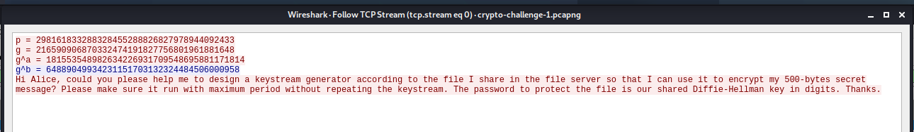

# [Cryptography] Can COViD steal Bob's idea?


The challenge provides a `.pcapng` file. I use `Wireshark` to open this file. 

I found three interesting data in this file.

1. Set filter: `tcp.stream eq 0`
2. Right-click the packet, `Follow` -> `TCP Stream`

From the image below, I know that they used a shared Diffie-Hellman key to encrypt their data. 
This means that g is the base, p is the modulo, g^a is the public key of `a` and g^b is the public key of `b`.

<p align="center">
    
</p>

1. Set filter: `tcp.stream eq 1`
2. Right-click the packet, `Follow` -> `TCP Stream`

The user retrieves a copy of `CryptoDesign.zip` file.

<p align="center">
    
</p>

1. Set filter: `tcp.stream eq 2`
2. Right-click the packet, `Follow` -> `TCP Stream`

This is the raw data of CryptoDesign.zip. I can extract the data by selecting `raw` and then select `Save As`. The zip file is password-protected (probably using shared diffie-hellman key). 

<p align="center">
    
</p>

So, I have to figure out the shared key.

Here is some background knowledge about Diffie-Hellman (From: https://en.wikipedia.org/wiki/Diffie%E2%80%93Hellman_key_exchange):

<p align="center">
    
</p>

So, I need to find the value of `a` and `b` in order to find the value of the shared key. To do this, I used [Discrete Logarithm calculator](https://www.alpertron.com.ar/DILOG.HTM).

<p align="center">
    
</p>

<p align="center">
    
</p>

So, I found the value of `a` and `b`:
```
a = 211631375588570729261040810141700746731
b = 164628728413072046550711086534226032119
```

With the value of `a` and `b`, I can find the value of the shared key.

<p align="center">
    
</p>


Flag: `govtech-csg{246544130863363089867058587807471986686}`

References: https://github.com/tudorog/ctf-writeups/blob/master/RITSEC%20CTF%202018/crypto/DarkPearAi.md