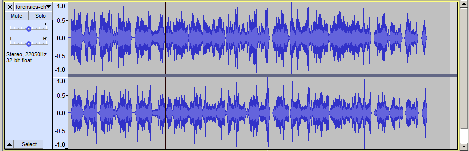
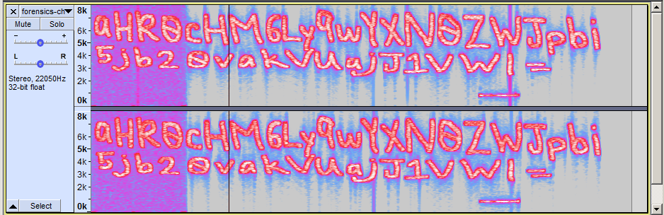
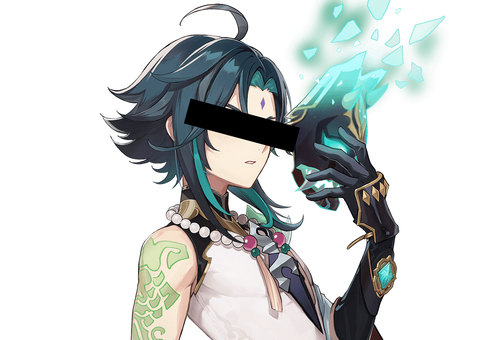
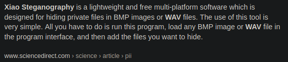
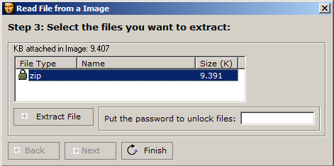
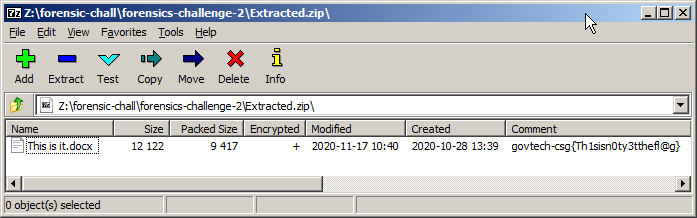

# [FORENSICS] Voices in the head

## Background

The description given for this challenge was:
```
We found a voice recording in one of the forensic images but we have no clue what's the voice recording about. Are you able to help? 
```
Provided free hint:
```
Xiao wants to help. Will you let him help you?
```

The voice recording provided is a [single wave file](files/forensics-challenge-2.wav). Well then, shall we begin with looking at the waves?

<br/>

## Analysing the Waves

There are two common tools that I often use for wave analysis, which are either [Audacity](https://www.audacityteam.org/download/) or [Sonic Visualizer](https://www.sonicvisualiser.org/download.html). Since I'm already logged in to Windows, let's work with using `Audacity` here.

<br/>

Let's load `forensics-challenge-2.wav` into `Audacity` and see if we can observe any patterns in the waveforms.

<p align="center">
    <br/>
</p>

Hmm, nothing seems to be out of ordinary or resembling a pattern here. Let's change the view to `Spectrogram` and see what happens.

<p align="center">
    <br/>
</p>

Bingo! It seems that we got our first lead. The above letters transcribes to a Base64 encoded string:

```
aHR0cHM6Ly9wYXN0ZWJpbi5jb20vakVUajJ1VWI=
```

This decodes to a link `https://pastebin.com/jETj2uUb`, which lies a cryptic message below:

```
++++++++++[>+>+++>+++++++>++++++++++<<<<-]>>>>++++++++++++++++.------------.+.++++++++++.----------.++++++++++.-----.+.+++++..------------.---.+.++++++.-----------.++++++.
```

It took me quite a while to decipher this message as I couldn't recall what the encoding here was, until one of my team members enlightened be that this was encoded using `Brainfuck`. I got brainf**ked indeed. Decoding the above message, we get:

```
thisisnottheflag
```
This seems to be our second lead, or it may just be a misdirection. In any case, we should log down this string as it may come in handy later.

<br/>

## Xiao to the rescue!

Now, let's take a step back and refer to the provided free hint.
```
Xiao wants to help. Will you let him help you?
```
Oh wait... Xiao, is that you? Are you coming to help me? What are the chances even, like 0.6%?!

<p align="center">
    <br/>
</p>

Performing a Google search with keywords "`xiao wav steganography`", I indeed got a result indicating that there is a software called `Xiao Steganography`, and it is used for hiding files in `BMP` and `WAV`.

<p align="center">
    <br/>
</p>

Disappointed that the other Xiao didn't come and help, I proceeded to load `forensics-challenge-2.wav` in `Xiao Steganography` and viola! There is indeed a zip file hidden in it! However, it seems to be protected with a password...

<p align="center">
    <br/>
</p>

Let's try the string `thisisnottheflag` that we have obtained earlier as the password and... bingo! The extraction seems to have been completed successfully. The resulting file is an encrypted zip file with a word document in it.

<p align="center">
    <br/>
</p>

The comment `govtech-csg{Th1sisn0ty3tthefl@g}` shown in the zip file is using the correct format for the flag submission, but as hinted in the flag, that is not the correct flag for this challenge indeed. Instead, let's try to use the comment as the password and extract `This is it.docx` within the zip.

The extraction was successful and finally! We successfully retrieved the flag for our challenge!

```
govtech-csg{3uph0n1ou5_@ud10_ch@ll3ng3}
```

The word document also kindly provided some hints for the next challenge. Just take note to use `Ctrl + A` when highlighting the texts as some of the hints were hidden using white fonts on a white background! How sneaky!

```
Clue to Forensic-Challenge-3: The registry path contains the words “covid”.

The attacker like to use Bifid Cipher
```