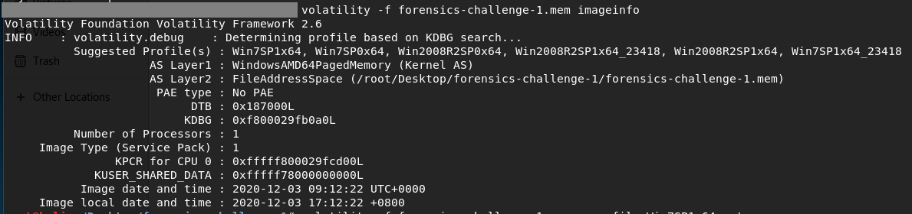
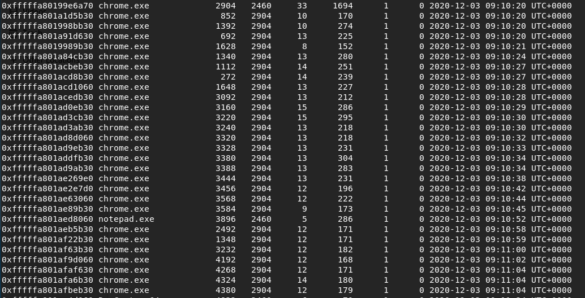
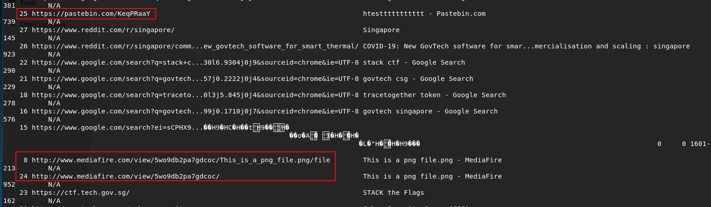
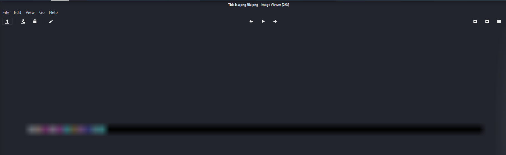
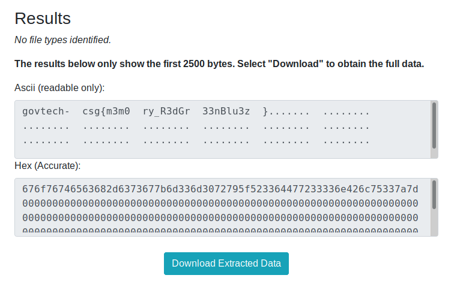

# [FORENSICS] Walking down a colourful memory lane

I use `volatility` to identify the Operating System (OS) of `forensics-challenge-1.mem`.

`$ volatility -f forensics-challenge-1.mem imageinfo`

    

From the above image, it shows that the OS used is Win7SP1x64. I can use `pslist` to list all the processes of the system.

`$ volatility -f forensics-challenge-1.mem --profile=Win7SP1x64 pslist`

    

Other than having multiple `chrome.exe` processes, I can't find any interesting processes. (Maybe, I can look at the chrome history?)

I download the [volatility plugins](https://github.com/superponible/volatility-plugins) and use `chromehistory` to dump the chrome history.

`$ volatility --plugins=plugins/ -f forensics-challenge-1.mem --profile=Win7SP1x64 chromehistory`

    

I found two interesting URLs in chrome history: https://pastebin.com/KeqPRaaY and http://www.mediafire.com/view/5wo9db2pa7gdcoc/This_is_a_png_file.png/file.

Going to the pastebin url, I found nothing interesting inside. Next, I download `This_is_a_png_file.png` file from the mediafire url. Below shows the image downloaded:

    

Since this is a forensics challenge, I guess the flag is hidden in the file. I run `binwalk`, `exiftool` to see if I can find any flag. However, there is no flag.
 
Next, I try to extract the data from the png file using [StegOnline](https://stegonline.georgeom.net/image). 

    

Flag: `govtech-csg{m3m0ry_R3dGr33nBlu3z}`

