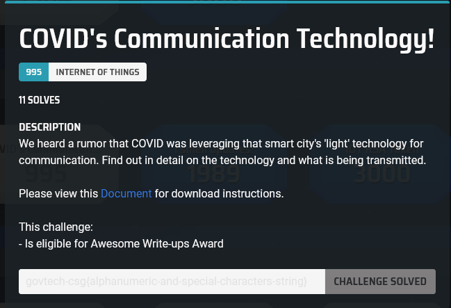
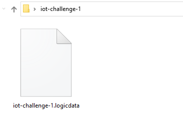
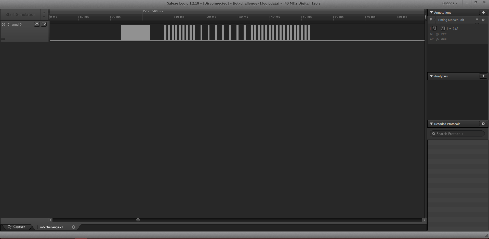
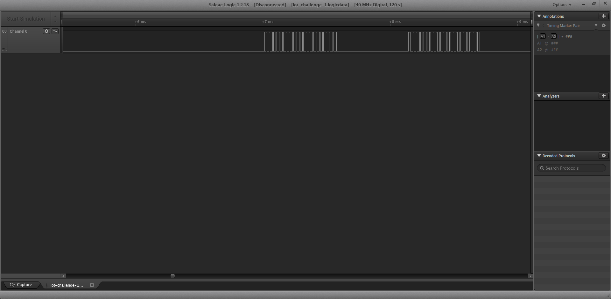
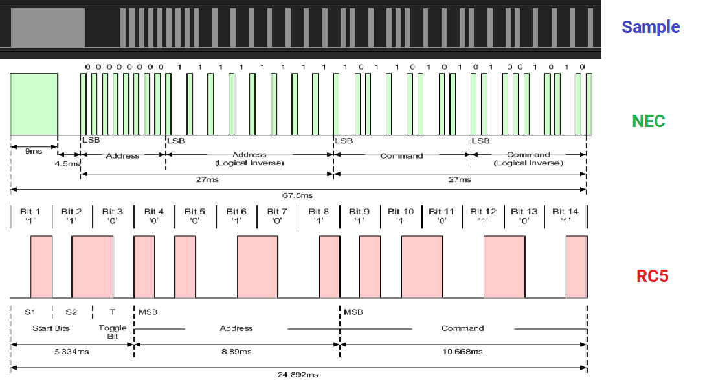
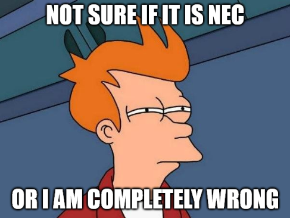
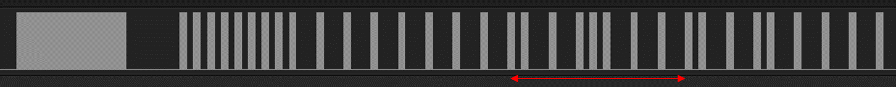
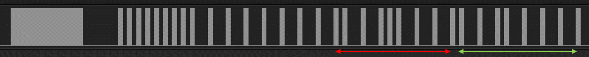
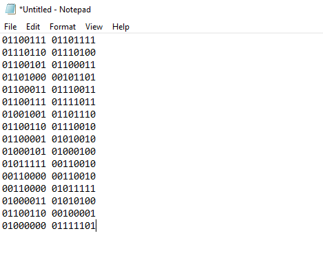
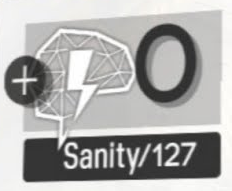

# [INTERNET OF THINGS] COVID's Communication Technology

I have not touched IoT challenges in CTF before so I decided to give this one a try, hoping I would learn something.

## Background

This was the challenge description we got:

Seems like something about '**light**' technology.

And we were given this file with a `.logicdata` extension:

It is not a file extension I have seen before. So after some intense Googling, I found that it is a file extension belonging to the [Saleae Logic Software](https://www.saleae.com/downloads/). With it, I was able to open the file up.

## Back to Physics class

When opening up the file, I noticed that it was a capture of some sort of signal. It looks like a barcode at first glance.

But when zoomed in you can see that it is some sort of modulated signal.

I was not very sure which 'light' technology this was but I suddenly remembered this song from my secondary school physics class:

From this song, I searched up communication technologies related to each EM wave, and finally decided to go with Infrared.

There were 2 popular encoding/decoding protocols for Infrared, *NEC* and *RC5*. I was not very sure which one it was so I compared them.

By visual observation, it seems to favour the NEC protocol.

So I tried to use NEC Analyser plugins from [LiveOverflow](https://github.com/LiveOverflow/NECAnalyzer) and [kodizhuk](https://github.com/kodizhuk/Salae-Logic-NEC-Analyzer) but for reason it didn't work. Looks like I have to do it manually...

The NEC protocol has 4 distinct 8 bit segments, in which the even segment are basically logical inverses (bit-flipped) versions of the odd segments. I figured that the important bits should be in the 3rd segment which is the command segment so I analysed it (shown in red underline below).

I was able to get the binary `0110 0111` which converted to `g` in ASCII. It looks like the `g` of `govtech-csg` flag format so I believe I was on the right track!

## Seeing the light

I moved on and decoded the 3rd segment of the next set of signals, and I got `0111 0110` which converted to `v` and I realised that I am missing an `o` so I looked back at the signal again. I discovered that the 4th segment was not a logical inverse of the 3rd segment but it actually contains data (shown in the green underline below)! Tricky indeed!

From this segment, I got `0110 1111`which translated to `o` . It turns out that each set of signals contained 2 bytes (2 x 8 bits) of information! With this knowledge in hand, I analysed the rest of the signals, it was really tedious **(;￣ー￣川**

RIP my sanity **(×_×;）**

After converting the binary I got to ASCII, I was able to get the flag.

> sanity? 0
>
> flag? `govtech-csg{InfraRED_2020_CTf!@}`
>
> hotel? Trivago.

Write-up by [*krusagiz*](https://github.com/krusagiz)